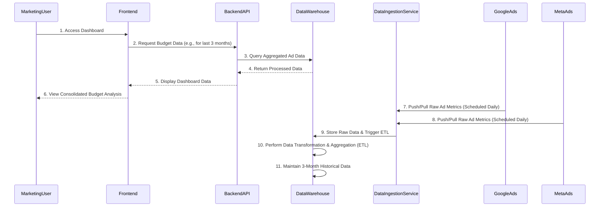

<p align="center">
  <a href="https://github.com/your-username/budget-analyzer">
    
  </a>
</p>

<h1 align="center">budget-analyzer</h1>

<p align="center">
  A professional, AI-generated documentation for your project.
  <br />
  <a href="https://github.com/your-username/budget-analyzer/issues">Report Bug</a>
  ·
  <a href="https://github.com/your-username/budget-analyzer/issues">Request Feature</a>
</p>

---

## 📋 IT Project Documentation

**Document Version:** 1.0
**Date:** July 30, 2025
**Prepared By:** Project Development Team
**Approved By:** Head of Digital Marketing Technology

---

## 📚 Table of Contents
1.  [Executive Summary](#1-executive-summary)
2.  [Introduction](#2-introduction)
3.  [Project Scope and Objectives](#3-project-scope-and-objectives)
4.  [Requirements Specification](#4-requirements-specification)
5.  [System Architecture and Design](#5-system-architecture-and-design)
6.  [Implementation Plan](#6-implementation-plan)
7.  [Testing and Quality Assurance](#7-testing-and-quality-assurance)
8.  [Deployment and Rollout](#8-deployment-and-rollout)
9.  [Risk Management](#9-risk-management)
10. [Timeline and Milestones](#10-timeline-and-milestones)
11. [Monitoring and Maintenance](#11-monitoring-and-maintenance)
12. [Appendices](#12-appendices)
13. [References](#13-references)

---

### 1. 📝 Executive Summary
*A high-level overview of the project, its goals, and status.*

**Project Background:** This project aims to develop a "budget-analyzer" tool specifically designed for analyzing the past three months of advertising spend and performance data from Google Ads and Meta Ads platforms. The goal is to provide marketing and finance teams with a unified, insightful view of digital ad budget allocation and effectiveness, identifying trends and supporting data-driven optimization decisions.
**Key Objectives:**
*   Centralize and consolidate advertising spend data from Google Ads and Meta Ads.
*   Provide a historical view (up to 3 months) of ad budget allocation and performance.
*   Enable analysis of trends and patterns in ad spend across platforms.
*   Offer actionable insights to optimize future ad campaigns and budget allocation.
*   Reduce manual effort and errors associated with data consolidation.
**Expected Outcomes:**
*   Improved visibility into digital ad spending.
*   Enhanced decision-making for marketing budget optimization.
*   Increased efficiency in reporting and analysis processes.
*   Potential for higher ROI on digital advertising investments.
**High-Level Timeline:**
*   **Q3 2025:** Requirements Gathering, Design, Initial Development (Core Features)
*   **Q4 2025:** Feature Completion, Testing, User Acceptance Testing (UAT)
*   **Q1 2026:** Production Deployment & Post-Launch Support
**Key Risks and Mitigations:**
*   **Data Source API Changes:** Regular monitoring of Google/Meta API documentation; flexible integration architecture.
*   **Data Quality/Consistency:** Implement robust data validation rules and automated reconciliation processes.
*   **Performance Bottlenecks:** Conduct load testing; optimize database queries and data aggregation routines.
*   **User Adoption:** Engage key stakeholders early; provide comprehensive training and intuitive UI/UX.

### 2. 🚀 Introduction
*Detailed project context, stakeholders, and assumptions.*

**Project Overview:** The 'budget-analyzer' project is initiated to address the growing complexity and volume of digital advertising spend across key platforms, specifically Google Ads and Meta Ads. Currently, reconciling and analyzing historical budget allocation and performance over a three-month period is a manual, time-consuming process involving disparate reports and spreadsheets. This often leads to fragmented insights, delayed decision-making, and inefficiencies in budget optimization. The 'budget-analyzer' will provide a unified, automated solution, empowering marketing and finance teams with a clear, consolidated view of past ad spend, allowing for deeper analysis of performance trends and facilitating more strategic allocation of future advertising budgets.
**Stakeholders:**
*   **Project Sponsor:** VP of Digital Marketing
*   **Business Owners:** Head of Performance Marketing, Marketing Operations Lead
*   **End Users:** Digital Marketing Team, Marketing Analysts, Finance Department
*   **Technical Team:** IT Development Lead, Data Engineering Team, DevOps Team
*   **Supporting Teams:** Cyber Security, Legal & Compliance
**Assumptions and Constraints:**
*   **Assumptions:**
    *   Access to necessary API credentials and permissions for Google Ads and Meta Ads.
    *   Historical data for the past 3 months is consistently available via platform APIs.
    *   Marketing and Finance teams are willing to adopt a new tool for budget analysis.
    *   Existing network infrastructure can support the new application's traffic.
*   **Constraints:**
    *   Initial scope limited to Google Ads and Meta Ads data only.
    *   Historical data analysis limited to a rolling three-month window.
    *   Project budget and timeline are fixed as per initial approval.
    *   Compliance with all internal data privacy and security policies (e.g., GDPR, CCPA).

### 3. 🎯 Project Scope and Objectives
*Defining the boundaries and success criteria of the project.*

**In-Scope Items:**
*   Automated data ingestion from Google Ads API (Campaign, Ad Group, Ad, Keyword performance data including cost, impressions, clicks, conversions).
*   Automated data ingestion from Meta Ads API (Campaign, Ad Set, Ad performance data including spend, impressions, clicks, conversions).
*   Centralized data storage solution capable of housing 3 months of historical data for both platforms.
*   Web-based user interface (dashboard) for visualizing consolidated budget and performance data.
*   Filtering capabilities by date range (past 3 months), platform, campaign, and ad group/ad set.
*   Reporting functionalities: Summary of total spend, spend by platform, spend by campaign, key performance indicators (KPIs) like CPC, CPA, CTR.
*   User authentication and authorization based on corporate Active Directory (AD).
*   Data export functionality (CSV, PDF) for generated reports.
**Out-of-Scope Items:**
*   Integration with other advertising platforms (e.g., LinkedIn Ads, TikTok Ads, Programmatic DSPs).
*   Real-time data synchronization; data updates will be on a scheduled basis (e.g., daily).
*   Predictive analytics or budget forecasting capabilities beyond historical trend identification.
*   Automated budget allocation or campaign optimization features (i.e., this is an analysis tool, not an automation tool).
*   Integration with internal CRM or sales data.
*   Complex multi-touch attribution modeling.
**Success Criteria:**
*   **Data Accuracy:** Consolidated data in the dashboard matches source data from Google Ads and Meta Ads APIs with >98% accuracy.
*   **Performance:** Dashboard reports load within 5 seconds for standard date ranges and filter selections. Daily data ingestion process completes within 30 minutes.
*   **Usability:** User Acceptance Testing (UAT) sign-off by 100% of participating Digital Marketing and Finance users.
*   **Adoption:** Achieves 80% adoption rate among target user groups within one month post-launch.
*   **Reliability:** System achieves 99.9% uptime during business hours.

### 4. 📋 Requirements Specification
*Detailed breakdown of all project requirements.*

**Functional Requirements:**

| ID | Requirement Description | Priority |
|----|-------------------------|----------|
| FR001 | The system shall allow users to log in securely via corporate Single Sign-On (SSO). | High |
| FR002 | The system shall automatically ingest daily spend and performance data from Google Ads API. | High |
| FR003 | The system shall automatically ingest daily spend and performance data from Meta Ads API. | High |
| FR004 | The system shall store a rolling 3-month history of daily ad performance data. | High |
| FR005 | The system shall display a consolidated dashboard summarizing total spend, impressions, clicks, and conversions across both platforms. | High |
| FR006 | The system shall allow users to filter dashboard data by specific date ranges within the 3-month window. | High |
| FR007 | The system shall allow users to filter dashboard data by individual ad platform (Google Ads, Meta Ads). | Medium |
| FR008 | The system shall allow users to drill down into campaign-level and ad group/ad set-level performance. | High |
| FR009 | The system shall calculate and display key metrics such as CPC (Cost Per Click), CPA (Cost Per Acquisition), CTR (Click-Through Rate), and ROAS (Return On Ad Spend). | High |
| FR010 | The system shall provide an option to export selected data views to CSV or PDF format. | Medium |
| FR011 | The system shall provide a mechanism for administrators to configure API credentials securely. | High |

**Non-Functional Requirements:**

| ID | Requirement Description | Category | Priority |
|----|-------------------------|----------|----------|
| NFR001 | The system shall have a user interface response time of less than 5 seconds for all dashboard views. | Performance | High |
| NFR002 | The daily data ingestion process for both platforms combined shall complete within 30 minutes. | Performance | High |
| NFR003 | All data stored at rest shall be encrypted using AES-256. | Security | High |
| NFR004 | All data in transit between components shall be encrypted using TLS 1.2 or higher. | Security | High |
| NFR005 | The system shall implement Role-Based Access Control (RBAC) to differentiate between view-only users and administrators. | Security | High |
| NFR006 | The system shall be available 99.9% of the time during business hours (Monday-Friday, 8 AM - 6 PM EST). | Reliability | High |
| NFR007 | The system shall be capable of supporting 100 concurrent users without degradation in performance. | Scalability | Medium |
| NFR008 | The system's architecture shall allow for future expansion to include additional ad platforms with minimal rework. | Maintainability | Medium |
| NFR009 | The user interface shall be intuitive and require minimal training for experienced marketing analysts. | Usability | High |

**Technical Requirements:**

| ID | Requirement Description | Category |
|----|-------------------------|----------|
| TR001 | The application shall be deployed on AWS Cloud infrastructure. | Infrastructure |
| TR002 | The backend services shall be developed using Python (e.g., FastAPI or Django). | Programming |
| TR003 | The frontend application shall be developed using React.js. | Programming |
| TR004 | The primary database for storing ad performance data shall be PostgreSQL. | Data Storage |
| TR005 | Data ingestion will utilize Google Ads API v13+ and Meta Marketing API v18+. | API Integration |
| TR006 | Containerization using Docker for all application components. | Deployment |
| TR007 | Orchestration using Kubernetes for scalable deployment. | Deployment |
| TR008 | CI/CD pipeline implementation (e.g., Jenkins, GitLab CI, AWS CodePipeline). | DevOps |

### 5. 🏗️ System Architecture and Design
*The technical blueprint of the system.*

**High-Level Architecture Diagram:**
This diagram outlines the main components of the budget-analyzer system and their interactions, illustrating a microservices-oriented approach on a cloud platform.

```mermaid
graph TD
    A[Marketing User] -- Web Browser --> B(Web Frontend);
    B -- REST API (HTTPS) --> C(API Gateway / Backend Service);

    subgraph Backend Services
        C -- Data Retrieval/ETL Trigger --> D(Data Ingestion Service);
        C -- Data Query --> E(Reporting Service);
    end

    D -- Google Ads API --> F(Google Ads Platform);
    D -- Meta Ads API --> G(Meta Ads Platform);
    D -- Write Data --> H[Data Warehouse (PostgreSQL)];
    E -- Read Data --> H;

    subgraph AWS Infrastructure
        H
        I[Authentication Service (AWS Cognito/AD)]
        J[Monitoring & Logging (CloudWatch, ELK)]
        K[CI/CD Pipeline]
    end

    A -- Authentication --> I;
    C -- Authentication --> I;
    I -- User/Role Validation --> C;
```

**Data Flow Diagram:**
This diagram illustrates how data moves through the budget-analyzer system, from initial ingestion to user consumption.



**Technology Stack:**

| Category | Component | Specific Technologies |
|----------|-----------|-----------------------|
| **Frontend** | User Interface | React.js, HTML5, CSS3, JavaScript (ES6+), Chart.js |
| **Backend** | API Services | Python (FastAPI/Django Rest Framework), Gunicorn, Nginx |
| **Data Ingestion** | ETL/Orchestration | Python scripts, Apache Airflow (for scheduling), AWS Lambda |
| **Database** | Relational DB | PostgreSQL (managed service like AWS RDS) |
| **Cloud Platform** | Infrastructure | AWS (EC2, S3, RDS, Lambda, VPC, IAM, CloudWatch) |
| **Containerization** | Virtualization | Docker |
| **Orchestration** | Container Mgmt | Kubernetes (AWS EKS) |
| **CI/CD** | Automation | GitLab CI/CD, AWS CodePipeline, Jenkins |
| **Version Control** | Code Repository | Git (GitHub Enterprise) |
| **Monitoring/Logging** | Observability | Prometheus, Grafana, ELK Stack (Elasticsearch, Logstash, Kibana), AWS CloudWatch |
| **Security** | Authentication | OAuth2, AWS Cognito, Corporate Active Directory (AD) |

### 6. 🛠️ Implementation Plan
*How the project will be built.*

**Development Methodology:** The project will follow an Agile Scrum methodology. Development will be organized into 2-week sprints, with regular sprint planning, daily stand-ups, sprint reviews, and retrospectives. This approach allows for flexibility, continuous feedback, and rapid iteration, ensuring that the evolving business needs are met effectively.

**Team Structure:**

| Role | Responsibilities |
|------|------------------|
| **Product Owner** | Defines and prioritizes product backlog, ensures alignment with business goals, liaison between business and development. |
| **Scrum Master** | Facilitates Scrum processes, removes impediments, coaches the team, ensures adherence to Agile principles. |
| **Backend Developers (x2-3)** | Design, develop, and maintain API services, data ingestion logic, and database interactions. |
| **Frontend Developers (x1-2)** | Design, develop, and maintain the user interface and user experience (UI/UX). |
| **QA Engineer (x1)** | Develop and execute test plans, identify and report defects, ensure product quality. |
| **DevOps Engineer (x1)** | Manage infrastructure, CI/CD pipelines, deployment processes, monitoring, and operational support. |

**Tools and Environments:**

*   **Project Management:** Jira for backlog management, sprint tracking, and bug tracking. Confluence for documentation and knowledge sharing.
*   **Source Code Management:** Git with GitHub Enterprise for version control, code reviews, and pull requests.
*   **IDE:** Developers will use their preferred IDEs (e.g., VS Code, PyCharm, WebStorm).
*   **CI/CD:** GitLab CI/CD pipelines will automate builds, tests, and deployments to development, staging, and production environments.
*   **Cloud Environments:** Separate AWS accounts or VPCs for Development, Staging, and Production environments to ensure isolation and proper testing.
*   **Container Registry:** AWS ECR for Docker image storage.

### 7. ✅ Testing and Quality Assurance
*Ensuring the project meets quality standards.*

**Testing Strategy:** A comprehensive testing strategy will be implemented across various stages of development to ensure the quality, reliability, and performance of the budget-analyzer system.

*   **Unit Testing:** Developers will write unit tests for all new code modules, ensuring individual components function as expected.
*   **Integration Testing:** Automated tests will verify the interactions between different services (e.g., frontend-backend API calls, backend-database interactions, ingestion service-API platform interactions).
*   **System Testing:** End-to-end tests will validate the entire system's functionality against the defined requirements, simulating real-world user scenarios. This includes data consistency checks.
*   **Performance Testing:** Load and stress tests will be conducted to ensure the system meets NFRs for response times and concurrent user capacity.
*   **Security Testing:** Regular vulnerability scanning, penetration testing (by a dedicated security team), and code reviews will be performed to identify and mitigate security risks.
*   **User Acceptance Testing (UAT):** Key business stakeholders from Marketing and Finance will conduct UAT to validate that the system meets their business needs and user expectations before production deployment. Feedback from UAT will drive final adjustments and sign-off.

**Defect Management:**
Defects will be tracked using Jira, following a standard lifecycle:
1.  **Identification & Reporting:** QA or any team member identifies a defect and logs it in Jira with detailed steps to reproduce, expected vs. actual results, and relevant screenshots/logs.
2.  **Triage:** The Scrum Master and Product Owner will review new defects in daily stand-ups or dedicated triage meetings, assigning priority and severity.
3.  **Assignment:** Defects are assigned to relevant developers for investigation and fix.
4.  **Fix & Testing:** Developers fix the defect, and QA re-tests the fix to ensure the original issue is resolved without introducing new regressions.
5.  **Verification & Closure:** Once verified, the defect is marked as closed.
Regular reports on defect trends and resolution times will be generated to monitor quality.

### 8. 🚢 Deployment and Rollout
*Plan for releasing the project to users.*

**Deployment Plan:**
The deployment process will leverage CI/CD pipelines to ensure consistent, automated, and reliable releases.

1.  **Staging Environment Deployment:**
    *   Once UAT is successfully completed and all critical bugs are resolved, the application will be deployed to a dedicated staging environment, mirroring production as closely as possible.
    *   Final sanity checks and smoke tests will be performed by the QA and DevOps teams.
2.  **Production Rollout - Phased Approach:**
    *   **Phase 1 (Pilot Launch):** The application will initially be rolled out to a small group of pilot users (e.g., 5-10 key marketing analysts and a finance representative). This allows for real-world usage feedback and identification of any unforeseen issues in a controlled environment.
    *   **Phase 2 (Wider Release):** Based on successful pilot feedback and resolution of any issues, the application will be incrementally rolled out to the broader Digital Marketing and Finance teams.
    *   **Deployment Strategy:** Blue/Green deployment will be preferred to minimize downtime. A new "green" environment will be deployed with the updated application, and traffic will be shifted gradually from the "blue" (old) environment to the "green" environment.
    *   **Automated Checks:** Automated health checks and performance monitoring will be active during traffic shifting to detect issues immediately.

**Rollback Procedures:**
Robust rollback procedures are critical to mitigate risks associated with new deployments.

1.  **Pre-Deployment Snapshot/Backup:** Before any production deployment, a full backup of the database and application configuration will be taken.
2.  **Automated Rollback Trigger:** Monitoring systems (e.g., CloudWatch alarms) will be configured to automatically trigger a rollback if critical errors (e.g., high error rates, service unavailability) are detected within a defined post-deployment window (e.g., 15-30 minutes).
3.  **Manual Rollback Process:** In case of non-automated critical failures or severe performance degradation, a manual rollback procedure will be initiated. This involves:
    *   Immediately shifting traffic back to the previous stable "blue" environment (in a Blue/Green setup).
    *   Reverting database changes if necessary (requires careful planning for backward compatibility).
    *   Alerting the development and operations teams for immediate investigation and root cause analysis.
4.  **Communication:** A clear communication plan will be in place to notify stakeholders in case of a rollback and provide status updates.

### 9. 🎲 Risk Management
*Identifying and mitigating potential problems.*

**Risk Identification:**

| Risk ID | Risk Category | Risk Description | Impact | Probability |
|---------|---------------|------------------|--------|-------------|
| R001    | Technical     | Third-party API (Google/Meta) changes break data ingestion. | High   | Medium      |
| R002    | Data          | Inaccurate or inconsistent data from source APIs. | High   | Medium      |
| R003    | Security      | Unauthorized access to sensitive advertising data. | High   | Low         |
| R004    | Performance   | Dashboard or reporting performance degradation with large data volumes. | Medium | Medium      |
| R005    | Business      | Low user adoption due to poor UX or lack of perceived value. | Medium | Medium      |
| R006    | Project       | Scope creep leading to project delays and budget overruns. | Medium | Medium      |
| R007    | Operations    | Deployment failures or system instability post-launch. | High   | Low         |

**Mitigation Strategies:**

| Risk ID | Mitigation Strategy | Owner | Status |
|---------|---------------------|-------|--------|
| R001    | Implement robust error handling and monitoring for API calls. Subscribe to Google/Meta API change notifications. Design modular API connectors. | Data Eng. | Ongoing |
| R002    | Implement data validation rules during ingestion. Automated reconciliation reports comparing ingested data with source reports. | Data Eng./QA | Ongoing |
| R003    | Adhere to corporate security policies. Implement OAuth2 for API access, RBAC, data encryption (at rest/in transit), regular security audits. | DevOps/Security | Ongoing |
| R004    | Conduct load testing and performance profiling. Optimize database queries, utilize caching mechanisms, and scale infrastructure as needed. | Dev/DevOps | Planned |
| R005    | Involve end-users in design and UAT. Provide comprehensive training and documentation. Gather and act on user feedback. | PO/Marketing | Ongoing |
| R006    | Maintain a strict change control process. Clearly define and communicate in-scope/out-of-scope items. Prioritize features based on business value. | PO/PM | Ongoing |
| R007    | Implement CI/CD with automated testing. Utilize blue/green deployment strategy. Establish clear rollback procedures. Implement comprehensive monitoring. | DevOps | Planned |

### 10. 🗓️ Timeline and Milestones
*Project schedule and key deliverables.*

**Project Schedule:**
The project is planned to span approximately 6-7 months from initiation to full production rollout, leveraging an agile, iterative approach.

| Phase | Duration | Key Activities |
|-------|----------|----------------|
| **Phase 1: Planning & Design** | Aug 2025 | Requirements Gathering, High-Level Architecture, Tech Stack Selection, Project Kick-off |
| **Phase 2: Core Development** | Sep - Oct 2025 | Data Ingestion Module, Core Database Schema, Backend APIs (Authentication, Data Retrieval), Basic Frontend Dashboard |
| **Phase 3: Feature Enhancement & Integration** | Nov - Dec 2025 | Advanced Filtering/Reporting, Data Aggregation Logic, Export Features, UI/UX Refinements, Security Enhancements |
| **Phase 4: Testing & UAT** | Jan 2026 | Comprehensive System Testing, Performance Testing, Security Audits, User Acceptance Testing |
| **Phase 5: Deployment & Go-Live** | Feb 2026 | Production Deployment, Pilot Program, Full User Rollout, Post-Launch Monitoring |

**Milestones:**

| Milestone ID | Milestone Description | Target Date | Dependencies | Deliverables |
|--------------|-----------------------|-------------|--------------|--------------|
| M1           | Project Charter & Requirements Sign-off | Aug 15, 2025 | -            | Approved Project Documentation, Detailed Requirements |
| M2           | Core Data Ingestion Operational | Sep 30, 2025 | M1           | Google/Meta Ads data successfully ingested into DB |
| M3           | Basic Dashboard MVP (Minimum Viable Product) | Oct 31, 2025 | M2           | Functional dashboard with aggregated spend/performance |
| M4           | Full Feature Complete (Feature Freeze) | Dec 15, 2025 | M3           | All defined features implemented and ready for test |
| M5           | User Acceptance Testing (UAT) Sign-off | Jan 31, 2026 | M4           | Signed-off UAT report by business stakeholders |
| M6           | Production Go-Live | Feb 28, 2026 | M5           | Application live and accessible to users |

### 11. 📈 Monitoring and Maintenance
*Post-launch support and operations.*

**Post-Deployment Monitoring:**
Comprehensive monitoring will be crucial for the stability and performance of the budget-analyzer post-deployment.

*   **Application Performance Monitoring (APM):** Tools like Prometheus and Grafana will be used to track application metrics (e.g., response times, error rates, resource utilization).
*   **Logging:** Centralized logging using the ELK Stack (Elasticsearch, Logstash, Kibana) or AWS CloudWatch Logs will capture application, system, and security logs for real-time analysis and troubleshooting.
*   **Alerting:** Automated alerts will be configured for critical events (e.g., service outages, high error rates, abnormal data ingestion failures, security breaches) and routed to the on-call DevOps and development teams via PagerDuty or Slack.
*   **Database Monitoring:** Specific metrics for PostgreSQL (e.g., connection count, query performance, disk space) will be monitored to ensure database health.
*   **Data Consistency Checks:** Automated daily reports will cross-verify ingested data with source APIs to ensure data integrity.

**Maintenance Plan:**
A robust maintenance plan will ensure the long-term viability and performance of the system.

*   **Service Level Agreements (SLAs):**
    *   **Critical Incidents (System Down, Data Ingestion Failure):** Max 1-hour response time, 4-hour resolution target.
    *   **High Priority (Major Functionality Impaired):** Max 4-hour response time, 24-hour resolution target.
    *   **Medium Priority (Minor Bug, Performance Degradation):** Max 8-hour response time, 3-day resolution target.
    *   **Low Priority (Cosmetic Issues, Feature Requests):** Addressed in next scheduled update cycle.
*   **Support Channels:** Users will primarily report issues via a dedicated IT Service Desk portal. Escalations will follow predefined paths to the DevOps or Development teams.
*   **Scheduled Maintenance:**
    *   **Weekly:** Health checks, log reviews, and minor data clean-up.
    *   **Monthly:** Performance review, security patch application, and minor system optimizations.
    *   **Quarterly:** Review of platform API changes, dependency updates, and minor feature enhancements/bug fixes as per product roadmap.
*   **Data Archiving/Retention:** Policies for historical data archiving beyond the 3-month active window will be established, likely moving older data to a cost-effective storage tier (e.g., AWS S3 Glacier).
*   **Security Updates:** Regular patching and vulnerability assessments will be conducted to ensure the system remains secure against evolving threats.

### 12. 📎 Appendices
*Supplementary information.*

**Glossary:**

| Term | Definition |
|------|------------|
| **API** | Application Programming Interface: A set of defined rules that enable different applications to communicate with each other. |
| **AWS** | Amazon Web Services: A comprehensive, broadly adopted, and widely used cloud platform. |
| **CPA** | Cost Per Acquisition: A marketing metric that measures the total cost of acquiring a new customer or lead. |
| **CPC** | Cost Per Click: A marketing metric that represents the cost an advertiser pays for each click on their ad. |
| **CTR** | Click-Through Rate: The ratio of users who click on a specific link to the number of total users who view a page, email, or advertisement. |
| **ETL** | Extract, Transform, Load: A three-step process used to integrate data from multiple sources into a data warehouse or central repository. |
| **KPI** | Key Performance Indicator: A measurable value that demonstrates how effectively a company is achieving key business objectives. |
| **Meta Ads** | The advertising platform for Meta's family of apps and services (Facebook, Instagram, Audience Network). |
| **PostgreSQL** | An open-source relational database management system emphasizing extensibility and SQL compliance. |
| **React.js** | A free and open-source front-end JavaScript library for building user interfaces based on UI components. |
| **ROI** | Return On Investment: A performance measure used to evaluate the efficiency or profitability of an investment. |
| **UAT** | User Acceptance Testing: The final phase of testing where actual users test the software to make sure it can handle required tasks in real-world scenarios. |
| **UI/UX** | User Interface/User Experience: UI refers to the visual elements of a product; UX refers to the overall experience a user has with a product. |

**Change Log:**

| Version | Date         | Author(s)             | Description                                |
|---------|--------------|-----------------------|--------------------------------------------|
| 1.0     | July 30, 2025 | Project Development Team | Initial release of the project documentation. |

### 13. 📜 References
*External standards and documents.*

*   **Google Ads API Documentation:** [https://developers.google.com/google-ads/api/docs/start](https://developers.google.com/google-ads/api/docs/start)
*   **Meta Marketing API Documentation:** [https://developers.facebook.com/docs/marketing-api/](https://developers.facebook.com/docs/marketing-api/)
*   **Company Internal Security Policy (SEC-001):** Available on Internal Confluence Portal
*   **AWS Well-Architected Framework:** [https://aws.amazon.com/architecture/well-architected/](https://aws.amazon.com/architecture/well-architected/)